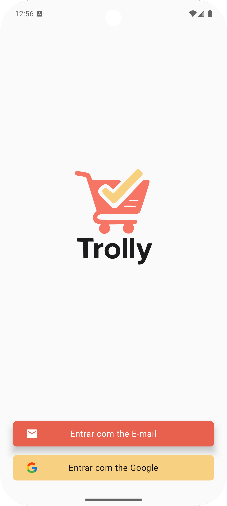
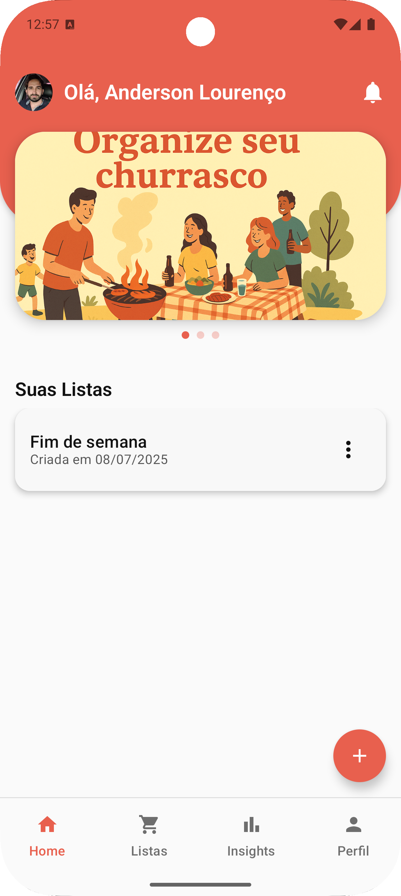
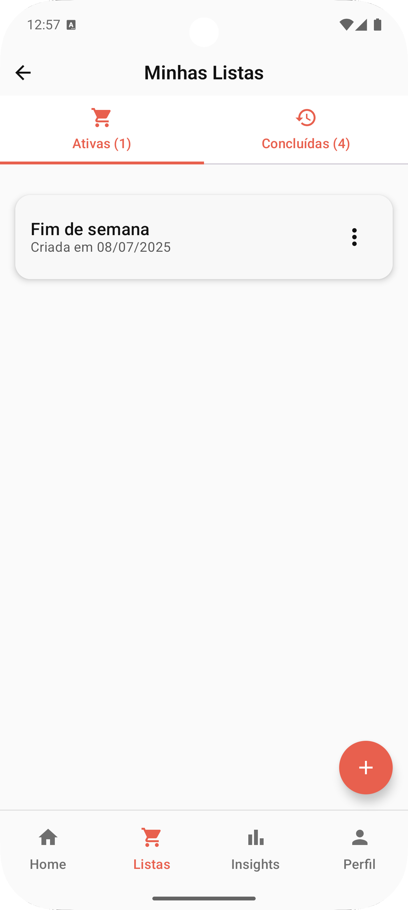
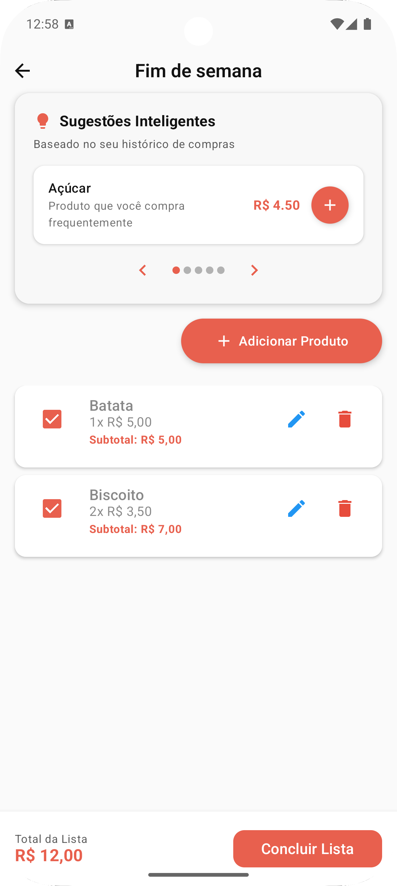
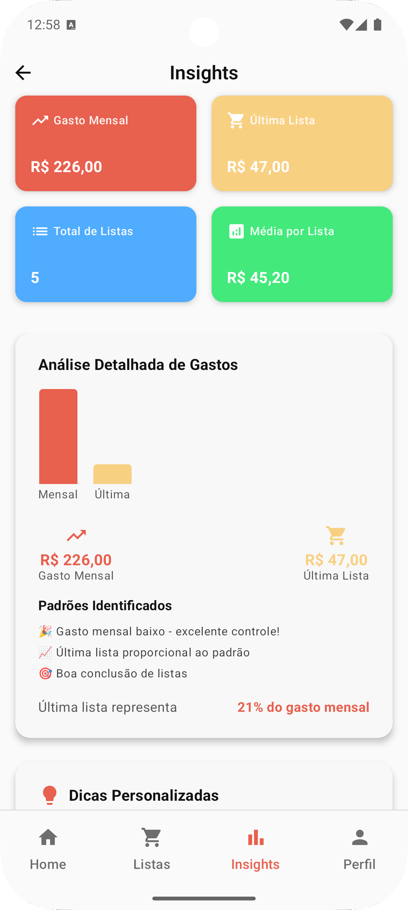

# 🛒 Trolly

Trolly é um aplicativo de listas de compras inteligente que ajuda você a planejar suas compras, economizar dinheiro e acompanhar seus hábitos de consumo ao longo do tempo.

---

## 📱 Prints do App

### Tela de Login

Login via e-mail ou Google.
Permitir que o usuário entre de forma simples e rápida com seu e-mail ou conta Google, garantindo uma experiência personalizada nas próximas interações.

---

### Home

Exibe saudações personalizadas, banners temáticos e listas recentes.
Ser a central de navegação e inspiração, com sugestões de listas temáticas e acesso rápido às listas criadas.

---

### Minhas Listas

Visualização de listas ativas e concluídas com data de criação.
Gerenciar todas as listas criadas pelo usuário, facilitando a visualização do que está em andamento e do histórico de compras.

---

### Detalhes da Lista

Adição de produtos, sugestões inteligentes com base no histórico, edição de itens e subtotal por produto.
Permitir ao usuário montar e ajustar sua lista de compras com praticidade, contando com ajuda da IA para otimizar tempo e lembrar de itens recorrentes.

---

### Tela de Insights

Resumo de gastos mensais, média por lista, total de listas e padrões identificados.
Oferecer uma análise visual e inteligente dos hábitos de consumo, incentivando controle financeiro e decisões mais conscientes.

---

## 🚀 Funcionalidades Atuais

- Cadastro e login (e-mail e Google)
- Criação de listas de compras
- Adição e edição de produtos
- Sugestões inteligentes baseadas no histórico de compras
- Cálculo de subtotais e total da lista
- Acompanhamento de gastos com gráficos e métricas
- Identificação de padrões de consumo
- UI responsiva com Jetpack Compose

---

## 🔧 Tecnologias Utilizadas

### Android App
- [Kotlin](https://kotlinlang.org/)
- [Jetpack Compose](https://developer.android.com/jetpack/compose)
- [Room Database](https://developer.android.com/jetpack/androidx/releases/room)
- [Material 3](https://m3.material.io/)

### Backend (em desenvolvimento)
- [Ktor](https://ktor.io/)
- [PostgreSQL](https://www.postgresql.org/)
- [Exposed ORM (opcional, caso use)](https://github.com/JetBrains/Exposed)

---

## 🔜 Funcionalidades Futuras

- Sincronização com backend (listas e histórico)
- Compartilhamento de listas com outras pessoas
- Reconhecimento de produtos por código de barras
- Notificações de validade dos itens
- IA para previsão de gastos mensais

---

## 🧪 Como Rodar

### Android (Frontend)
1. Clone o repositório
2. Abra no Android Studio
3. Execute com um emulador ou dispositivo físico

### Backend (Ktor) - En desenvolvimento
1. Clone o backend ([trolly-backend](https://github.com/andersonlourenc/trolly-backend.git))

---

## 👨‍💻 Autor

**Anderson Lourenço**  
[GitHub](https://github.com/andersonlourenc)  
Estudante de Ciência da Computação 

---

## 📝 Licença

Esse projeto está sob a licença MIT. Veja o arquivo [LICENSE](./LICENSE) para mais detalhes.

